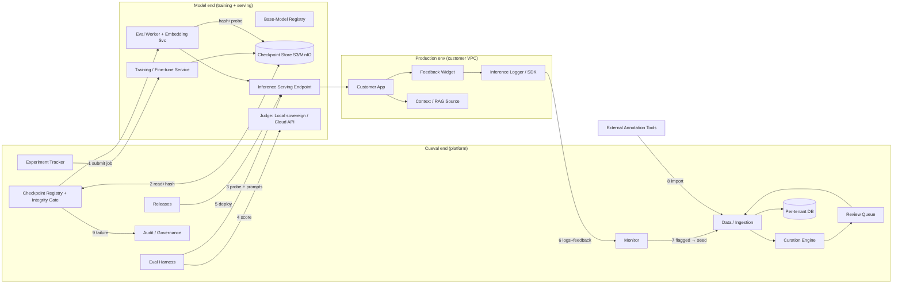

# Cueval — Architecture & Solution-Diagram Pointers

> **Purpose.** A structured brief to feed into Claude Desktop to author a detailed design
> document + architecture/solution diagram. It spans three domains: **Cueval end** (the
> platform), **Model end** (training + serving infra), and **Production env** (the customer's
> deployed application and the feedback loop back into Cueval).
>
> **Prototype vs. target.** The shipping Cueval is a single-file, browser-only prototype
> (`index.html`, no backend, in-memory state, mock scoring/eval/hashing). This brief describes
> the **target production architecture** the prototype represents. Wherever a capability is
> *simulated* today, it's tagged **[mock→real]** so the design doc can state the real
> implementation. Do not describe the browser mock as if it were the production system.

---

## 0. How to use this brief
- Treat each numbered **integration contract** (§4) as an **arrow** in the diagram.
- Treat each **component** (§3) as a **box/container**; group by the three domains as **swimlanes**.
- Produce **two diagram levels** (C4-style): a **Context** diagram (the 3 domains + external actors) and a **Container** diagram (services/stores/queues inside each domain).
- Render the **sequence flows** (§7) as separate diagrams — they carry the "why," the static diagram carries the "what."
- Keep the **trust boundaries** (§5) visible on the diagram (dashed boxes / colored regions): tenant isolation, sovereign-vs-cloud egress, checkpoint-integrity gate.

---

## 1. Scope & the three domains

| Domain | Owns | Boundary responsibility |
|---|---|---|
| **Cueval end** | Data ingestion, curation, annotation, experiment tracking, eval/judging, release governance, production monitoring, audit. The system of record for *data quality* and *model governance*. | Multi-tenant isolation; RBAC; audit trail; decides what is "good enough" to ship. |
| **Model end** | Base-model registry, fine-tuning/training compute, checkpoint artifacts + store, model-serving/inference endpoints, the judge model. | Produces and serves weights; exposes endpoints Cueval calls for eval + integrity checks. |
| **Production env** | The customer's live application calling the deployed fine-tuned model; inference logging; user-feedback capture; RAG/context provision. | Emits production signals; closes the loop back into Cueval's Data + Review. |

**One-line thesis for the doc:** *"From raw data and documents to training-ready datasets, to governed releases, to production monitoring, and back — every inference makes the next model smarter, under strict tenant isolation and verifiable model integrity."*

---

## 2. Primary actors / personas (RBAC)
- **SuperAdmin** (Lynkstr Labs operator) — cross-tenant platform view, billing, config, alerts. *No tenant data access except explicit read-only impersonation.*
- **Admin** (tenant) — full tenant control, settings, users, audit log.
- **Project Manager** — releases, approvals, project health.
- **Architect** — data strategy, corpus seeding, approvals.
- **ML Engineer** — experiments, checkpoints, eval, integrations.
- **Reviewer** — review queue (text/OCR/preference).
- **Annotator** — annotation tasks only.
- **External systems** — annotation tools (Label Studio/Argilla/Prodigy), the customer's production app, training cluster, object store, judge (local/cloud).

---

## 3. Component catalog (boxes in the diagram)

### 3a. Cueval end
| Component | Responsibility | Notes / [mock→real] |
|---|---|---|
| **Auth & Tenancy** | Login, session, role matrix, **database-per-tenant** isolation, SuperAdmin impersonation (read-only), plan/limit enforcement (Starter/Pro/Enterprise), demo access gate. | [mock→real] real IdP/SSO (OIDC/SAML), per-tenant DB or schema, row-limit metering. |
| **Data / Ingestion** | Three ingestion paths converging to instruction rows: **Structured** (JSONL/CSV/TSV/Parquet upload), **Documents** (PDF/scan → OCR → chunking → synthesis), **Import** (annotation-tool connectors). | [mock→real] file storage, parsers, OCR engine, chunker, LLM synthesis service. |
| **Curation Engine** | Quality scoring, PII detection, toxicity, near-dup, language detection, **diversity score**, **pair-type distribution**; auto-approve vs flag thresholds. | [mock→real] real scoring models/heuristics, embedding-based dedup + clustering. |
| **Review Queue** | Human-in-the-loop: text review, OCR corrections, **preference ranking (RLHF)**, annotation projects, batch approval, annotator session-health/fatigue. | Feeds approved rows back to datasets. |
| **Dataset Versioning / Snapshots** | Immutable dataset versions, source provenance (upload/doc/import), snapshot hashes. | Lineage anchor for experiments. |
| **Experiment Tracker** | Reproducible training-run log: dataset version + config + lineage (dataset→checkpoint→eval), clone/reproduce. | Submits jobs to Model end (§4.1). |
| **Checkpoint Registry** (§44) | Records `weightsHash`, `baseModel{id,version,source}`, `inferenceEndpoint`, `adapterType/loraRank`, **probe fingerprint**, `integrityStatus`. Registration flow computes hash + captures probe. | **[mock→real]** today hashes/embeddings are seeded; real = SHA256 of weights file + probe-response embedding. |
| **Eval Harness** | Rubric-weighted **LLM-judge** eval (Factuality, Instruction-Following, Tone, Task-Completion, Refusal), **local sovereign judge** vs **cloud judge** (DLP-gated), **swap-augmented** (position-bias reduction), confidence intervals, **Krippendorff α** agreement, human-eval mode, reference-grounded factuality (score against ingested corpus), accuracy monitor. | Calls Model-end endpoints + judge (§4.3–4.4). |
| **Integrity Gate** (§44) | Before every eval: recompute weights hash vs stored + probe-fingerprint cosine; **block** on mismatch, **warn** on drift; base-model-change warning at experiment creation. | Writes to Audit log. |
| **Releases** | Gated state machine: draft → in-review → approved → deployed; approval workflow; eval-threshold gates. | Triggers deploy to Production (§4.5). |
| **Monitor** | Production-inference monitoring: drift, factuality/hallucination flags, user 👎, cold-start, coverage; regression baselines on deploy. | Consumes Production signals (§4.6). |
| **Agents** | Automation: Curation Agent (auto-approve), Release Agent, Eval-Trigger Agent, Dataset-Improvement Agent. | Governed, undoable actions. |
| **Governance** | **Audit log** (integrity failures, overrides, registrations), activity feed, notifications, integration guide. | Admin-visible; tenant-scoped. |
| **Platform (SuperAdmin)** | Cross-tenant aggregates, billing, feature flags, alerts. | Separate accessor plane; never a "filter off" of tenant views. |

### 3b. Model end
| Component | Responsibility | Notes |
|---|---|---|
| **Base-Model Registry** | Source base models (HuggingFace/local): Mistral-7B, Llama-3.1-8B, Sarvam-2B, Gemma-2-9B, etc. + version pinning. | Base-model id/version stored on checkpoint. |
| **Training / Fine-tune Service** | SFT + LoRA/full fine-tune jobs; consumes a dataset version + training config (epochs, LR, batch, LoRA rank, optimizer); emits a checkpoint. | GPU cluster / job orchestrator. |
| **Checkpoint Store** | Object storage for weights artifacts (`adapter_model.safetensors` / full model): **Local path / S3 / MinIO / HuggingFace**. | The file the integrity hash is computed over. |
| **Inference Serving** | Serves each checkpoint behind an **endpoint URL** (vLLM/TGI-style); used both as eval target and as production model. | Same URL can serve different weights → why probe fingerprint exists. |
| **Judge Model** | **Local sovereign judge** (e.g. Mistral-7B INT8, on-prem, ₹0, no egress) OR **cloud judge** (Claude/GPT-4 via API, per-token cost, data leaves network → DLP gate). | Chosen per eval run. |
| **Eval Worker** (§44 real counterpart) | The server-side process with filesystem + endpoint access that actually (a) hashes the weights file and (b) sends the probe to the endpoint and embeds the response. | **This is where real integrity detection lives** — it cannot run in the browser mock. |
| **Embedding Service** | Computes probe-response embeddings (e.g. MiniLM, 384-dim) for fingerprint comparison. | Needed for §44 Addition 2. |

### 3c. Production env
| Component | Responsibility | Notes |
|---|---|---|
| **Customer Application** | The live app (chatbot/assistant) calling the deployed model's inference endpoint. | Owned by the tenant. |
| **Inference Logger / SDK** | Cueval SDK/snippet capturing inferences + latency + context; ships to Cueval Monitor. | Integration Guide covers this. |
| **Feedback Widget** | User 👍/👎 and free-text feedback on responses. | Feeds Monitor + corpus seeding. |
| **Context / RAG Source** | Provides retrieval context at inference — enables reference-grounded factuality scoring. | Factuality scored vs *this* corpus, not judge general knowledge. |

---

## 4. Integration contracts (the arrows)
Number these on the diagram; each is a boundary-crossing interface.

1. **Cueval Experiment Tracker → Training Service.** Submit training job = {dataset version (immutable), training config}. Returns a **checkpoint** (weights artifact + metadata). *[mock→real]*
2. **Cueval Checkpoint Registry ↔ Checkpoint Store.** On registration: read weights file → compute **SHA256** → store hash; store location/endpoint/base-model/adapter. On eval: re-read + re-hash. *[mock→real]*
3. **Cueval Eval Harness → Inference Endpoint (target).** (a) **Probe request** (fixed question) for fingerprint; (b) **eval prompts** to score the candidate checkpoint. Response embeddings compared for drift.
4. **Cueval Eval Harness → Judge.** Either **local judge** (in-network, sovereign) or **cloud judge API** (egress; **DLP confirmation required**, per-token billing). Returns per-dimension scores; swap-augmented two-pass.
5. **Cueval Releases → Production Deploy.** On release approved → **deploy checkpoint** to the production inference endpoint; marks a Monitor timeline deployment + resets regression baseline.
6. **Production (SDK) → Cueval Monitor.** Stream inferences + latency + provided context + user feedback. Tenant-scoped ingestion endpoint/API key.
7. **Cueval Monitor → Data/Review.** Flagged inferences (hallucination, 👎, drift) → **corpus seeding** / new **annotation sprints** → re-enter the Data module. *This is the closing arrow of the loop.*
8. **External Annotation Tools → Import Connector.** Label Studio/Argilla/Prodigy exports → field mapping → converted instruction pairs → rows.
9. **Integrity failure → Audit log + Admin notification.** Auto-written on hash/probe mismatch; blocks eval.

---

## 5. Trust & security boundaries (draw these explicitly)
- **Tenant isolation** — database-per-tenant; every data access scoped to `tenantId`; SuperAdmin is a *separate plane*, not an unfiltered tenant view. (Highest-priority boundary.)
- **Sovereign vs. cloud egress** — Enterprise/sovereign deployments keep *everything* on-prem (local judge, local models, no external API). Cloud judge = **data leaves the network** → explicit DLP acknowledgement gate. Mark the egress arrow (§4.4 cloud path) as crossing the trust boundary.
- **Checkpoint integrity boundary (§44)** — weights hash (file tamper) + probe fingerprint (endpoint swap) + base-model-change warning. Eval is *blocked* if integrity fails. Show the Integrity Gate sitting between Eval and the Model end.
- **RBAC** — role matrix gates every screen/action; least-privilege.
- **Audit & non-repudiation** — integrity failures, overrides, registrations, approvals are logged, Admin-visible, tenant-scoped.
- **Secrets** — no credentials in artifacts; API keys per tenant for Monitor ingestion; endpoint auth for model serving.
- **Plans/limits** — row/eval/seat quotas per plan; enforcement points at ingest + eval + user-add.

---

## 6. Deployment topologies (call out which the doc targets)
- **SaaS multi-tenant** — Cueval hosted; per-tenant DB isolation; cloud or local judge selectable.
- **Sovereign / air-gapped on-prem** (Enterprise) — Cueval + models + judge all in the customer's network; no external egress; local judge mandatory.
- **Hybrid** — Cueval SaaS control plane, models served in customer VPC; eval worker runs where it can reach both the weights file and the endpoint.
- Note the **eval-worker placement** constraint: it needs filesystem access to the checkpoint store *and* network access to the inference endpoint — this drives where it must be deployed in each topology.

---

## 7. Key sequence flows (author as separate sequence diagrams)

**7a. End-to-end lifecycle (the golden path)**
Ingest (Data: structured/doc/import) → Curate (scoring/PII/dedup/diversity) → Review (approve rows) → Snapshot dataset version → Train (Model end) → **Register checkpoint** (hash + probe) → **Eval** (integrity gate → judge → rubric scores, CIs, α) → Release gate (threshold) → **Deploy** to Production → **Monitor** (drift/feedback) → flagged signals → corpus seeding → back to Ingest.

**7b. Checkpoint integrity check at eval (§44)**
Run Eval clicked → Eval Worker reads `checkpoint.location` → recompute weights hash → compare to stored → {match: continue} / {mismatch: block + audit + notify Admin} → send probe to endpoint → embed response → cosine vs stored → {≥0.95 proceed / 0.85–0.95 warn+log-if-proceed / <0.85 block} → run judged eval.

**7c. Production feedback loop**
Customer app → inference (+context) → SDK logs to Monitor → Monitor scores factuality vs ingested corpus + captures 👎 → flags → Dataset-Improvement Agent proposes corpus additions / annotation sprint → Review Queue → approved rows → next dataset version.

---

## 8. Cross-cutting concerns (dedicate a doc section each)
- **Observability** — structured domain events (`log.event`), Monitor dashboards, agent action log, drift/regression baselines.
- **Data lineage & provenance** — every training row traceable to source (upload/document region/import task); dataset→checkpoint→eval→release chain.
- **Governance & audit** — approvals, integrity events, overrides; retention.
- **Cost & sustainability** — local (₹0, sovereign) vs cloud judge (per-token); training compute; row/eval quotas.
- **Model-relative quality** — dataset quality scores are calibrated per base model; base-model change invalidates comparability (Ye et al., 2025, arxiv:2510.13212) — surfaced as a warning.
- **Internationalization** — multilingual corpora (EN/HI/TA/TE/KN…), script detection in OCR.

---

## 9. Target data stores & services (for the Container diagram — [mock→real])
The prototype is in-memory; the real system needs:
- **Per-tenant relational DB** (projects, datasets, rows, experiments, checkpoints, releases, evals, users, audit).
- **Object store** for uploads, documents, checkpoint artifacts (S3/MinIO).
- **Vector store / embedding index** for dedup, diversity clustering, probe fingerprints, RAG.
- **Job queue + workers** for ingestion, OCR, synthesis, training submission, eval, integrity checks.
- **GPU cluster / training orchestrator** (Model end).
- **Model-serving layer** (inference endpoints).
- **Metering/billing service** (plan limits).
- **IdP/SSO** (auth).

---

## 10. Open questions / assumptions to resolve in the doc
1. Isolation model: DB-per-tenant vs schema-per-tenant vs row-level — pick and justify.
2. Where does the **Eval Worker** run per topology (SaaS vs sovereign vs hybrid)?
3. Hash scope: adapter-only vs full-model; how to hash sharded weights deterministically.
4. Probe fingerprint: embedding model choice, threshold governance, false-positive handling on legitimate endpoint upgrades.
5. Training integration: is Cueval orchestrating training, or only registering externally-trained checkpoints?
6. Deploy mechanism (§4.5): does Cueval push to serving, or hand off to the customer's MLOps?
7. Monitor ingestion: push SDK vs pull; sampling; PII handling in production logs.
8. Cloud-judge data-governance: redaction/DLP before egress; which tenants may enable it.
9. SLAs for eval/monitor; scale targets (rows/tenant, inferences/day).

---

## 11. Suggested diagram skeleton (Mermaid — Container level)
Give Claude Desktop this as a starting point; refine styling/labels.

---

## 12. Glossary (seed)
- **Checkpoint** — a registered set of model weights (adapter or full) with integrity metadata.
- **Probe fingerprint** — embedding of a fixed-question response, used to detect endpoint weight swaps.
- **Swap-augmented eval** — two-pass judging with positions swapped to reduce position bias.
- **Reference-grounded factuality** — scoring answers against the ingested corpus, not judge general knowledge.
- **Sovereign deployment** — fully on-prem, zero external egress; local judge.
- **Release gate** — eval-threshold + approval barrier before deploy.
